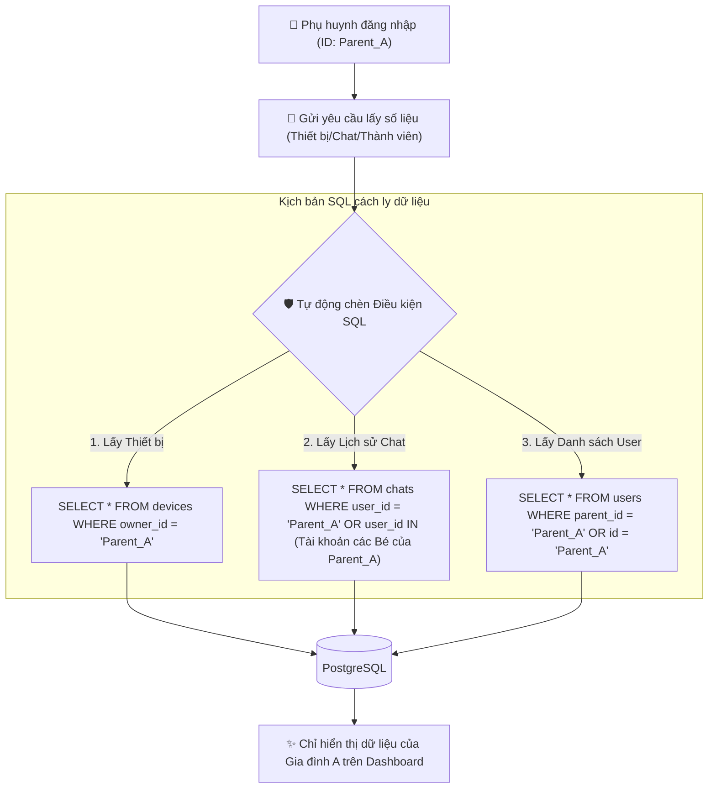

# Hệ thống Phân quyền Người dùng (RBAC - Role-Based Access Control)
## Hệ sinh thái PTalk Web Dashboard

Tài liệu này mô tả chi tiết kiến trúc và luồng xử lý của hệ thống **Phân quyền Người dùng (RBAC)** trong dự án PTalk Web Dashboard. Hệ thống được thiết kế theo nguyên tắc bảo mật đa tầng **Zero-Trust**, đảm bảo dữ liệu gia đình được cách ly tuyệt đối nhưng vẫn cung cấp quyền giám sát tổng thể cho Quản trị viên (SuperAdmin).

---

## 1. 3 Khía Cạnh Phân Quyền Trong Hệ Thống

### A. Cấp độ Vai trò Quản trị (Dashboard Role)
Quyết định các mục hiển thị trên giao diện (Sidebar, Menu) và các trang hệ thống được phép truy cập:

* **SuperAdmin (Tài khoản tối cao - `is_superuser = true`):**
  * *Quyền hạn:* Có toàn quyền cao nhất trên hệ thống Dashboard.
  * *Trang truy cập:* Có quyền truy cập các trang nhạy cảm như `/users` (Quản lý & CRUD người dùng) và `/settings` (Cấu hình hệ thống).
  * *Dữ liệu:* Xem thống kê tổng thể toàn hệ thống (Tổng người dùng, tổng lượt requests, radar thiết bị toàn mạng).
* **ProductAdmin / Support (Admin sản phẩm & Hỗ trợ kỹ thuật):**
  * *Quyền hạn:* Được quyền hỗ trợ kỹ thuật, kiểm tra cấu hình thiết bị khi người dùng báo lỗi, cấu hình thông tin robot nhưng không được can thiệp vào tài khoản hệ thống.
* **Viewer (Người dùng thông thường - Phụ huynh):**
  * *Quyền hạn:* Bị chặn hoàn toàn quyền truy cập vào `/users` và `/settings`. 
  * *Hành vi chặn:* Edge Middleware sẽ quét URL yêu cầu; nếu phát hiện cố truy cập trái phép, lập tức chặn đứng và chuyển hướng về trang báo lỗi `/unauthorized`.

### B. Cấp độ Loại Tài khoản Gia đình (User Type)
Giúp hệ sinh thái Robot nhận diện đúng đối tượng tương tác để đồng bộ dữ liệu và áp dụng chính sách API bảo mật:

* **owner (Chủ tài khoản - Phụ huynh):** Người mua robot, đăng ký tài khoản chính thức và đăng nhập trực tiếp vào Web Dashboard. Phụ huynh sở hữu và quản lý các thiết bị Robot vật lý (`owner_id` trong DB trỏ về ID Phụ huynh).
* **child (Tài khoản phụ - Trẻ em):**
  * Được tự động tạo trong DB khi phụ huynh gán tên Bé vào thiết bị Robot.
  * **Tài khoản này không đăng nhập vào Web Dashboard**, chỉ dùng để kết nối và tương tác trực tiếp với Robot phần cứng thông qua mã Token riêng biệt.
  * Nhật ký hội thoại của Bé được lưu và hiển thị trực tiếp cho Phụ huynh giám sát trên Dashboard.
* **elder (Tài khoản Người cao tuổi):** Tương tự tài khoản trẻ em nhưng chuyên dụng cho giải pháp chăm sóc sức khỏe người già (Elder Kare).

### C. Gói cước Dịch vụ (Subscription Tier)
* **basic (Gói dùng thử / Demo):** Người dùng đăng ký tài khoản tự do nhưng chưa mua thiết bị vật lý. **Bị chặn truy cập hoàn toàn** các tính năng nội bộ trên Web Dashboard (ngoại trừ trang giới thiệu sản phẩm) để thúc đẩy nâng cấp.
* **pro (Gói Pro):** Dành cho phụ huynh có nhu cầu giám sát cơ bản.
* **ultra (Gói Cao cấp nhất):** **Tự động kích hoạt (Auto-Upgrade)** ngay khi phụ huynh thực hiện đăng ký Serial & MAC của robot vật lý lần đầu tiên. Được sử dụng không giới hạn tất cả các tính năng thông minh của Dashboard.

---

## 2. Sơ đồ Luồng Kiểm tra Quyền hạn (RBAC Flowchart)

Luồng kiểm tra quyền truy cập tự động được thực hiện ở tầng NextAuth v5 Edge Middleware trước khi trang được render:

```mermaid
graph TD
    %% Styling
    classDef admin fill:#818cf8,stroke:#4f46e5,stroke-width:2px,color:#fff;
    classDef user fill:#34d399,stroke:#059669,stroke-width:2px,color:#fff;
    classDef block fill:#f87171,stroke:#dc2626,stroke-width:2px,color:#fff;
    classDef process fill:#60a5fa,stroke:#2563eb,stroke-width:2px,color:#fff;

    Start(["🖥️ Người dùng truy cập Trang / API"]) --> CheckLogin{"🔑 Đã đăng nhập?"}
    
    %% Trạng thái chưa đăng nhập
    CheckLogin -->|Chưa| RedirectLogin["➡️ Chuyển hướng về /login"]:::block
    
    %% Trạng thái đã đăng nhập
    CheckLogin -->|Đã có Session| CheckBasic{"💎 Gói cước Basic?"}
    
    %% Kiểm tra Basic (Demo)
    CheckBasic -->|Đúng| IsSuper1{"👑 Là SuperAdmin?"}
    IsSuper1 -->|Không| BlockDemo["❌ Chặn & chuyển về /unauthorized"]:::block
    IsSuper1 -->|Có| AllowDashboard["🔓 Cho phép vào Dashboard toàn cục"]:::admin
    
    %% Các gói trả phí (Pro / Ultra)
    CheckBasic -->|Không (Gói Pro/Ultra)| CheckAdminPage{"📂 Trang yêu cầu quản trị? (/users, /settings)"}
    
    %% Kiểm tra trang admin
    CheckAdminPage -->|Đúng| IsSuper2{"👑 Là SuperAdmin?"}
    IsSuper2 -->|Có| AccessAdmin["🔓 Cho phép vào trang Quản lý Admin"]:::admin
    IsSuper2 -->|Không| BlockAdminPage["❌ Chặn & chuyển về /unauthorized"]:::block
    
    CheckAdminPage -->|Không (Trang thường)| AccessUser["🔓 Cho phép vào Dashboard gia đình (Family Scope)"]:::user
```

---

## 3. Sơ đồ Cô lập Dữ liệu Gia đình (Family Data Isolation Flow)

Để đảm bảo các gia đình không bao giờ nhìn thấy hoặc can thiệp dữ liệu của nhau, cơ chế phân quyền can thiệp trực tiếp vào câu lệnh SQL tại Backend API dựa trên thông tin phiên đăng nhập (`Session User`):



---

## 4. Tóm tắt Tiện ích nổi bật của Kiến trúc Phân quyền này
1. **Bảo mật tuyệt đối (Edge Security):** Việc chặn quyền truy cập diễn ra ngay tại tầng Middleware (trước khi Next.js render trang), giúp tối ưu hóa băng thông và ngăn chặn hacker thăm dò cấu trúc thư mục.
2. **Không rò rỉ chéo dữ liệu (Family Data Isolation):** Ngay cả khi người dùng biết ID thiết bị của người khác, các API backend luôn xác thực quyền sở hữu (`owner_id == session.user.id`) trước khi trả về dữ liệu.
3. **Thân thiện với người dùng:** Phụ huynh chỉ cần cắm nguồn Robot phần cứng thực tế và khai báo MAC/Serial, hệ thống sẽ tự động nâng cấp quyền hạn và tạo sẵn tài khoản con tương ứng mà không đòi hỏi bất kỳ cấu hình kỹ thuật phức tạp nào.
